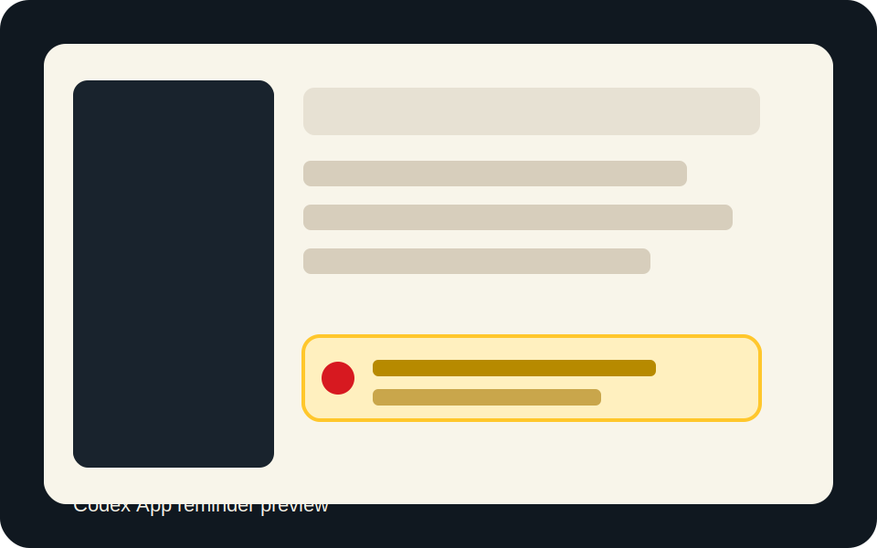
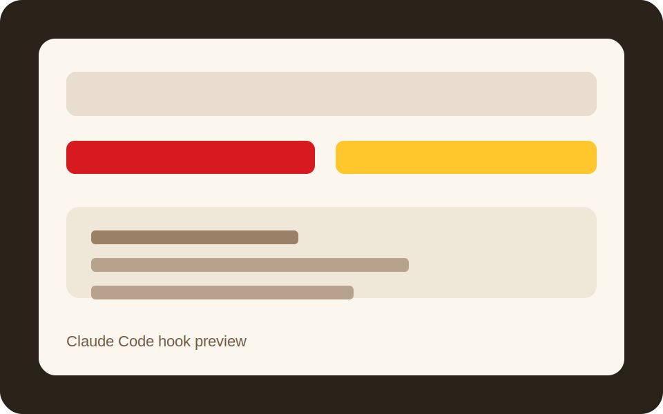
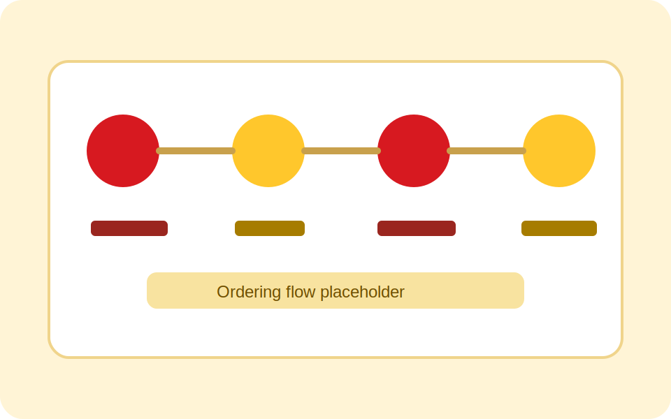

<div align="center">
  
  <h1>去码头整点薯条</h1>
  <p><b>饭点到了，代码可以等一口热薯条。</b></p>
  <a href="https://github.com/DreamArc77/FriesOnThePier/stargazers"></a>
  <a href="plugins/fries-on-the-pier/.codex-plugin/plugin.json"></a>
  <a href="https://github.com/DreamArc77/FriesOnThePier"></a>
  <a href="https://github.com/DreamArc77/FriesOnThePier"></a>
</div>

去码头整点薯条是一个同时支持 Codex 和 Claude Code 的饭点关怀插件。

它会在你长时间写代码、并且刚好到了午饭或晚饭时间时，在回答末尾轻轻补一句提醒。你如果回复“帮我点”，它会进入点单模式，通过麦当劳中国官方 MCP 服务 `mcd-mcp` 帮你完成查地址、选门店、看菜单、算价、创建订单、打开支付链接和查询订单状态。

插件只负责提醒、引导、编排和下单前确认；真实履约能力来自麦当劳中国官方 MCP。插件不会保存你的 MCP Token、手机号或完整收货地址，也不会自动下单或代替你支付。

## 预览

<table>
<tr>
  <td align="center" width="33%">
    
    <br><b>Codex App</b>
    <br><sub>回答末尾自然追加饭点关怀</sub>
  </td>
  <td align="center" width="33%">
    
    <br><b>Claude Code</b>
    <br><sub>同一套插件结构，双端可用</sub>
  </td>
  <td align="center" width="33%">
    
    <br><b>点餐流程</b>
    <br><sub>确认后通过官方 MCP 完成履约</sub>
  </td>
</tr>
</table>

## 统计

| 双端支持 | 饭点窗口 | 官方点餐工具 | 本地敏感信息保存 |
|---|---:|---:|---:|
| Codex + Claude Code | 2 个 | 8 个 | 0 项 |

## 安装

### Codex App

1. 打开 Codex App，进入任意一个对话。
2. 输入下面的命令，把本仓库添加为插件市场：

```text
/plugin marketplace add DreamArc77/FriesOnThePier
```

如果界面要求确认来源，选择添加这个 marketplace。

3. 安装插件：

```text
/plugin install fries-on-the-pier@fries-on-the-pier
```

如果安装列表里只出现一个 `fries-on-the-pier`，也可以直接选择它安装。安装范围建议选择用户级，这样所有 Codex 对话都能使用。

4. 安装完成后，在当前对话里输入：

```text
启用自动饭点提醒
```

插件会在当前对话里完成 Codex App 自动提醒配置，不需要你手动编辑配置文件。完成后，完全退出并重新打开 Codex App。

5. 重新打开后正常使用 Codex 写代码。到饭点时，回答末尾会出现自然提醒。
6. 如果你想点餐，回复：

```text
帮我点
```

首次点餐时，如果麦当劳中国官方 MCP 尚未连接，插件会在当前对话里引导你打开 `open.mcd.cn` 或 `https://mcp.mcd.cn` 获取 MCP Token。获取后直接粘贴到当前对话，插件会帮你写入用户级配置并连接 `mcd-mcp`；如果 Codex App 需要重新加载环境变量，插件会提示你重启 App 后继续点餐。

### Codex CLI

启动 Codex CLI 后，在交互界面里输入：

```text
/plugin marketplace add DreamArc77/FriesOnThePier
/plugin install fries-on-the-pier@fries-on-the-pier
```

也可以先在终端里添加 marketplace：

```bash
codex plugin marketplace add DreamArc77/FriesOnThePier
```

然后进入 Codex CLI 交互界面安装插件。安装完成后输入：

```text
启用自动饭点提醒
```

随后按提示完成自动提醒配置和麦当劳 MCP Token 配置。

### Claude Code

在 Claude Code 中添加本仓库 marketplace：

```text
/plugin marketplace add DreamArc77/FriesOnThePier
/plugin install fries-on-the-pier@fries-on-the-pier
```

安装后正常使用 Claude Code。饭点提醒由插件 hook 触发；接受提醒后，插件会在当前对话里引导你配置麦当劳中国官方 MCP Token，并继续完成点单流程。

### 麦当劳 MCP Token

插件使用麦当劳中国官方 MCP 服务：

```text
Server name: mcd-mcp
URL: https://mcp.mcd.cn
Transport: streamablehttp
Auth: Authorization: Bearer <MCP Token>
```

首次点餐时，插件会引导你获取并配置 Token。Token 只应写入 Codex / Claude Code 的用户级 MCP 配置或用户环境变量，不应写入插件目录。
