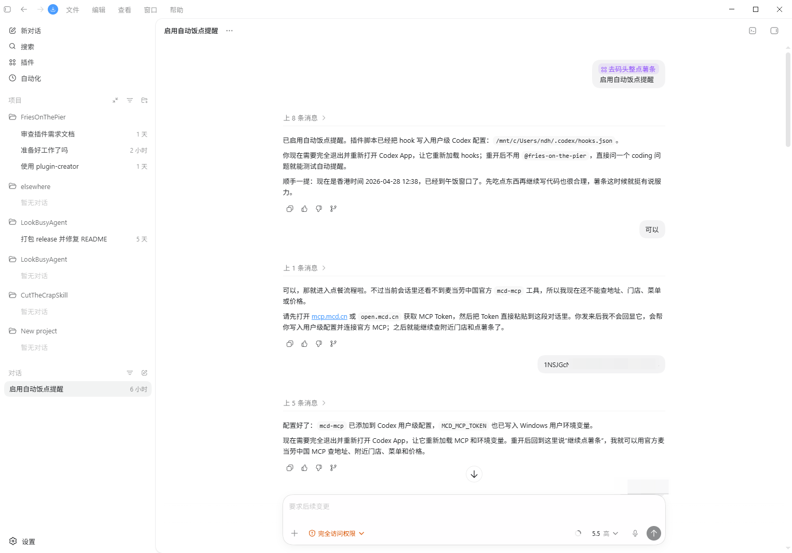
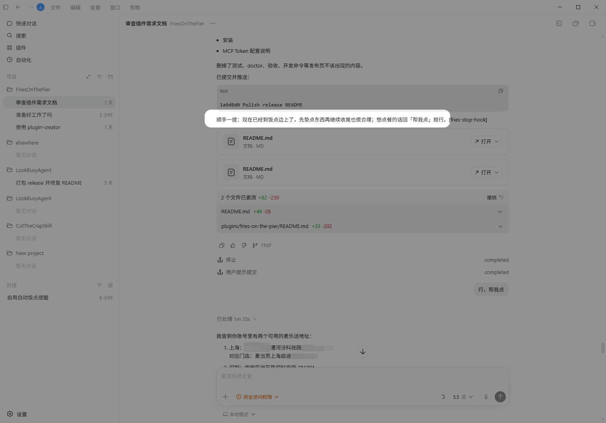
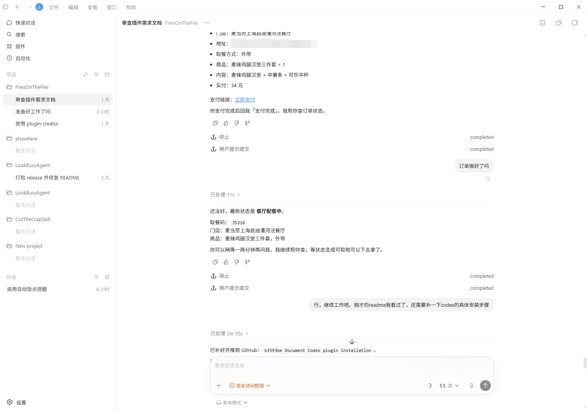

<div align="center">
  
  <h1>去码头整点薯条</h1>
  <p><b>饭点到了，代码可以等一口热薯条。</b></p>
  <a href="https://github.com/DreamArc77/FriesOnThePier/stargazers"></a>
  <a href=".codex-plugin/plugin.json"></a>
  <a href="../../LICENSE"></a>
  <a href="https://github.com/DreamArc77/FriesOnThePier"></a>
  <a href="https://github.com/DreamArc77/FriesOnThePier"></a>
</div>

去码头整点薯条是一个同时支持 Codex 和 Claude Code 的饭点关怀插件。

它会在你写代码写到午饭或晚饭时间时，在回答末尾自然地提醒一句。你如果回复“帮我点”，插件会进入点单模式，通过麦当劳中国官方 MCP 服务 `mcd-mcp` 帮你完成从查地址、选门店、看菜单、算价到创建订单和查询订单状态的流程。

插件只负责提醒、引导、编排和安全确认。真实地址、门店、菜单、价格、订单和支付链接都来自麦当劳中国官方 MCP。插件不会保存 MCP Token、手机号或完整地址，也不会自动下单或代替你支付。

## 预览

<table>
<tr>
  <td align="center" width="33%">
    
    <br><b>安装与配置</b>
    <br><sub>安装插件后，在对话里完成自动提醒和 MCP Token 配置</sub>
  </td>
  <td align="center" width="33%">
    
    <br><b>饭点轻提醒</b>
    <br><sub>不打断工作，只在回答末尾自然补一句关心</sub>
  </td>
  <td align="center" width="33%">
    
    <br><b>自然语言点餐</b>
    <br><sub>从选餐、确认到支付和查单，全程聊天推进</sub>
  </td>
</tr>
</table>

## 统计

| 双端支持 | 饭点窗口 | 官方点餐工具 | 本地敏感信息保存 |
|---|---:|---:|---:|
| Codex + Claude Code | 2 个 | 8 个 | 0 项 |

## 安装

### Codex App

1. 打开 Codex App，进入任意一个对话。
2. 输入下面的命令，把本仓库添加为插件市场：

```text
/plugin marketplace add DreamArc77/FriesOnThePier
```

如果界面要求确认来源，选择添加这个 marketplace。

3. 安装插件：

```text
/plugin install fries-on-the-pier@fries-on-the-pier
```

如果安装列表里只出现一个 `fries-on-the-pier`，也可以直接选择它安装。安装范围建议选择用户级，这样所有 Codex 对话都能使用。

4. 安装完成后，在当前对话里输入：

```text
启用自动饭点提醒
```

插件会在当前对话里完成 Codex App 自动提醒配置，不需要你手动编辑配置文件。完成后，完全退出并重新打开 Codex App。

5. 重新打开后正常使用 Codex 写代码。到午饭或晚饭时间时，插件会在回答末尾补上一句轻提醒。
6. 如果想点餐，回复：

```text
帮我点
```

首次点餐时，如果 `mcd-mcp` 还不可用，插件会在当前对话里引导你打开 `https://open.mcd.cn/mcp` 获取麦当劳中国官方 MCP Token。获取后直接粘贴到当前对话，插件会帮你写入用户级配置并继续点单；如果 Codex App 需要重新加载环境变量，插件会提示你重启 App 后继续。

### Codex CLI

启动 Codex CLI 后，在交互界面里输入：

```text
/plugin marketplace add DreamArc77/FriesOnThePier
/plugin install fries-on-the-pier@fries-on-the-pier
```

也可以先在终端里添加 marketplace：

```bash
codex plugin marketplace add DreamArc77/FriesOnThePier
```

然后进入 Codex CLI 交互界面安装插件。安装完成后输入：

```text
启用自动饭点提醒
```

随后按对话提示完成自动提醒和麦当劳 MCP Token 配置。

### Claude Code

在 Claude Code 中添加并安装插件：

```text
/plugin marketplace add DreamArc77/FriesOnThePier
/plugin install fries-on-the-pier@fries-on-the-pier
```

安装后正常使用 Claude Code。饭点时插件会在回答末尾追加轻提醒；你回复“帮我点”后，插件会在当前对话中引导你配置麦当劳中国官方 MCP Token，并继续完成点单流程。

### 麦当劳 MCP Token

插件使用麦当劳中国官方 MCP 服务：

```text
Server name: mcd-mcp
URL: https://mcp.mcd.cn
Transport: streamablehttp
Auth: Authorization: Bearer <MCP Token>
```

首次点餐时，插件会引导你打开 `https://open.mcd.cn/mcp` 获取 Token，并在当前对话里帮你完成配置。你只需要提供 Token，不需要手动配置 MCP。Token 只应保存到 Codex / Claude Code 的用户级 MCP 配置或用户环境变量中，不应写入插件目录。
